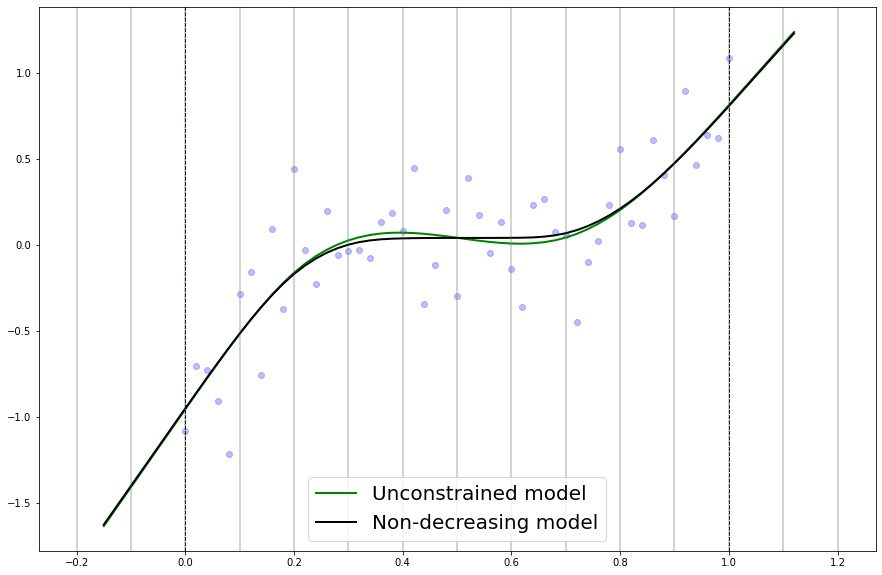
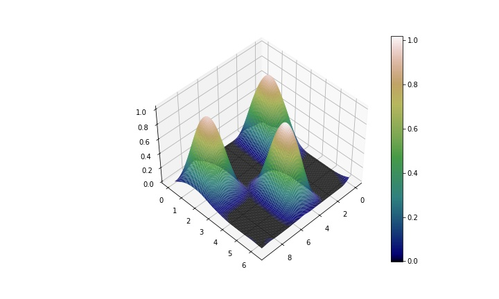

# cpsplines

`cpsplines` is a Python module to perform constrained regression under shape
constraints on the component functions of the dependent variable. It is assumed
that the smooth hypersurface to be estimated is defined through a reduced-rank
basis (B−splines) and fitted via a penalized splines approach (P−splines). To
embed requirements about the sign of any order partial derivative (including the
function itself), the constraints are included into the fitting procedure as
hard constraints, yielding a semidefinite optimization model. In particular, the
problem of estimating the component function using this approach is stated as a
convex conic optimization problem with a quadratic objective function.

Sign related constraints are imposed using a well-known result carried out by
Bertsimas and Popescu, 2002. This enables to enforce non-negativity of a
univariate polynomial over a finite interval, which can be straightforwardly
extended to the sign of any higher order derivative. When only one covariate is
related to the response variable, these constraints are successfully fulfilled
over the whole domain of the regressor sample. However, when dealing with
multiple regression, this equivalence does not hold, so alternative approaches
must be developed. The proposed framework in this repository uses the
equivalence relation for univariate polynomials by imposing the constraints over
a finite set of curves which belong to the hypersurface.

At present, `cpsplines` can handle constrained regression problems for an
arbitrary number of variables, where all the interaction term are considered. In
this setting, the smooth hypersurface is constructed from the tensor products of
B-splines basis along each axis. When data is arranged in a grid, efficient
algorithms accelerating the computations are used (Currie, Durban and  Eilers,
2006). On this repository, the fitting procedure is performed using the method
`CPsplines`, whose main features are the following:

* Arbitrary number of variables.
* Arbitrary knot sequence length to construct the B-spline basis.
* Arbitrary B-spline basis degrees.
* Arbitrary difference orders on the penalty term.
* Out-of-range prediction (backwards and forward) along every dimension (Currie
  and Durban, 2004), and the constraints are enforced both on the fitting and
  the prediction region.
* The smoothing parameters are selected as the minimizer of the Generalized
  Cross Validation criteria, but this routine can be done either by choosing the
  best parameters out of a set of candidates or by finding them using numerical
  methods.
* Enforcing sign related constraints over the fitting and prediction range (if
  prediction is required). Arbitrary number of sign constraints can be imposed
  along each regressor.
* Enforcing the hypersurface (or any partial derivative) attains a certain value
  at a certain point.
* Enforcing the hypersurface is a probability density function, i.e., it is
  non-negative and it integrates to one.  
* Choose among several distributions from the exponential family, currently
  implemented for Gaussian, Poisson and Binomial. For the last two distribution,
  only sign and monotonocity constraints can be enforced.
* Internally decides whether the input data can be rearranged into a grid or
  not, and exploits the array structure of the data when this is the case.

Solving the optimization problems is done using [MOSEK](https://www.mosek.com)
optimization software.

## Project structure

The current version of the project is structured as follows:

* **cpsplines**: the main directory of the project, which consist of:
  * **fittings**: contains the smoothing algorithms.
  * **graphics**: constituted by graphic methods to visualize the results.
  * **mosek_functions**: contains the functions used to define the optimization
    problems.
  * **psplines**: composed by several methods that build the main objects of
    P-splines.
  * **utils**: integrated by a miscellanea of files used for a variety of
    purposes (numerical computations, data processing, ...).
* **data**: a folder containing CSV files used in the real data numerical
  experiments.
* **examples**: a directory containing multiple numerical experiments, using
  both synthetic and real data sets.
* **img**: contains some images used in this `README.md` file.
* **tests**: a folder including tests for the main methods of the project.

## Package dependencies

`cpsplines` mainly depends on the following packages:

* [Joblib](https://joblib.readthedocs.io/).
* [Matplotlib](https://matplotlib.org/).
* [MOSEK](https://www.mosek.com). **License Required**
* [Numpy](https://numpy.org/).
* [Pandas](https://pandas.pydata.org/).
* [Scipy](https://www.scipy.org/).
* [Tensorly](http://tensorly.org/).
* [Statsmodels](https://www.statsmodels.org/).

MOSEK requires a license to be used. For research or educational purposes, a
free yearly and renewable [academic
license](https://www.mosek.com/products/academic-licenses/) is offered by the
company. For other cases, a 30-day [trial license](https://www.mosek.com/try/)
is available. According to MOSEK indications, the license file (`mosek.lic`)
must be located at

```{bash}
$HOME/mosek/mosek.lic                (Linux/OSX)
%USERPROFILE%\mosek\mosek.lic        (Windows)
```

## Installation

1. To clone the repository on your own device, use

```{bash}
git clone https://github.com/ManuelNavarroGarcia/cpsplines.git
cd cpsplines
```

2. To install the dependencies, there are two options according to your
   installation preferences:

* Create and activate a virtual environment with `conda` (recommended)

```{bash}
conda env create -f env.yml
conda activate cpsplines
```

* Install the setuptools dependencies via `pip`

```{bash}
pip install -r requirements.txt
pip install -e .[dev]
```

3. If neccessary, add version requirements to existing dependencies or add new
   ones on `setup.py`. Then, update `requirements.txt` file using

```{bash}
pip-compile --extra dev > requirements.txt
```

and update the environment with `pip-sync`. Afterwards, the command

```{bash}
pip install -e .[dev]
```

needs to be executed.

## Usage

To illustrate the usage of the repository, let's see how `CPsplines` works with
two examples, the first with only one regressor and the  second two covariates.

For the univariate case, consider the function

<p align="center">
  
</p>

which is a non-decreasing function. We simulated noisy data following the scheme

<p align="center">
  
</p>


We fit an unconstrained and a constrained model imposing non-decreasing
constraints over the interval [-0.15, 1.12] (forward and backwards prediction).
For the basis, cubic B-splines with 10 interior knots are taken with a
second-order difference penalty. The smoothing parameter is selected using
`scipy.optimize.minimize` with the `"SLSQP"` method.

```python
# Generate the data 
np.random.seed(6)
x = np.linspace(0, 1, 51)
y = (2 * x - 1) ** 3 + np.random.normal(0, 0.25, 51)
data = pd.DataFrame({"x": x, "y": y})
# Build and fit the two models: unconstrained and non-decreasing 
# The constraints follows the syntax 
# {variable index : {derivative order: {constraint sign: upper or lower bound}}}
example1D_1 = CPsplines(
    deg=(3,),
    ord_d=(2,),
    n_int=(10,),
    x_range={0: (-0.15, 1.12)}, # variable index : range
    sp_method="optimizer",
    sp_args={"options": {"ftol": 1e-12}},
)
example1D_1.fit(data=data, y_col="y")

example1D_2 = CPsplines(
    deg=(3,),
    ord_d=(2,),
    n_int=(10,),
    x_range={0: (-0.15, 1.12)},
    sp_method="optimizer",
    sp_args={"options": {"ftol": 1e-12}},
    int_constraints={0: {1: {"+": 0}}} 
)
example1D_2.fit(data=data, y_col="y")
# Plot the results
# Dashed vertical lines are the limits of the fitting region and grey vertical lines corresponds to the position of the knots
ax = plt.gca()
for estimator, c in zip((example1D_1, example1D_2), ("g", "k")):
    _ = CurvesDisplay.from_estimator(estimator,
                                     X=data["x"],
                                     y=data["y"],
                                     knot_positions=True, 
                                     constant_constraints=True,
                                     col_pt="b",
                                     ax=ax,
                                     **{"c": c}
                                     )

legend = ax.legend(('Unconstrained model','Non-decreasing model'), loc=8, prop={'size': 20})
legend.legendHandles[0].set_color('g')
legend.legendHandles[1].set_color('k')
```



For the bivariate case, consider the function
<p align="center">
  
</p>

We simulated noisy data following the scheme

<p align="center">

</p>

We fit an unconstrained and a constrained model imposing non-negativity
constraints over the interval

<p align="center">

</p>

(no prediction). For the bases, cubic B-splines with 30 and 20 interior knots
are taken, respectively, with a second-order difference penalty. The smoothing
parameter is selected as the best candidates out of the sets {10, 100} (for the
first smoothing parameter) and {10, 50, 100} (for the second smoothing
parameter).

```python
# Generate the data 
np.random.seed(5)
x = np.linspace(0, 3 * np.pi, 301)
y = np.linspace(0, 2 * np.pi, 201)
z = np.outer(np.sin(x), np.sin(y)) + np.random.normal(0, 1, (301, 201))
data = grid_to_scatter(x=[x, y], y=z, y_col="z")
# Build and fit the non-negativity constrained model
example2D = CPsplines(
    deg=(3, 3),
    ord_d=(2, 2),
    n_int=(30, 20),
    sp_method="grid_search",
    sp_args={"grid": [(10, 100), (10, 50, 100)]},
    int_constraints={0: {0: {"+": 0}}, 1: {0: {"+": 0}}}
)
example2D.fit(data=data, y_col="z")
#Plot the results
_ = SurfacesDisplay.from_estimator(example2D, 
                                   orientation=(45,45), 
                                   figsize=(10, 6), 
                                   **{"cmap": "gist_earth"}
                                   )
```



## Testing

The repository contains a folder with unit tests to guarantee the main methods
meets their design and behave as intended. To launch the test suite, it is
enough to enter `pytest`. If only one test file wants to be run, the syntax is
given by

```{bash}
pytest tests/test_<file_name>.py
```

Moreover, a GitHub Action runs automatically all the tests but
`tests/test_solution.py` (which requires MOSEK license) when any commit is
pushed on any Pull Request.

## Contributing

Contributions to the repository are welcomed! Regardless of whether it is a
small fix on the documentation or a notable feature to be included, I encourage
you to develop your ideas and make this project greater. Even suggestions about
the code structure are highly appreciated. Furthermore, users participating on
these submissions will figure as contributors on this main page of the
repository.

There are many ways you can contribute on this repository:

* [Discussions](https://github.com/ManuelNavarroGarcia/cpsplines/discussions).
  To ask questions you are wondering about or share ideas, you can enter an
  existing discussion or open a new one.

* [Issues](https://github.com/ManuelNavarroGarcia/cpsplines/issues). If you
  detect a bug or you want to propose an enhancement of the current version of
  the code, a issue with reproducible code and/or a detailed description is
  highly appreciated.

* [Pull Requests](https://github.com/ManuelNavarroGarcia/cpsplines/pulls). If
  you feel I am missing an important feature, either in the code or in the
  documentation, I encourage you to start a pull request developing this idea.
  Nevertheless, before starting any major new feature work, I suggest you to
  open an issue or start a discussion describing what you are planning to do.
  Recall that, before starting a pull request, all unit test must pass on your
  local repository.

## Contact Information and Citation

If you have encountered any problem or doubt while using `cpsplines`, please
feel free to let me know by sending me an email:

* Name: Manuel Navarro García (he/his)
* Email: manuelnavarrogithub@gmail.com

The formal background of the models used in this project are either published in
research papers or under current research. If these techniques are helpful to
your own research, consider citing the related papers of the project and/or this
repository:

```{bash}
@article{NAVARROGARCIA2023,
title = {On constrained smoothing and out-of-range prediction using P-splines: A conic optimization approach},
journal = {Applied Mathematics and Computation},
volume = {441},
pages = {127679},
year = {2023},
issn = {0096-3003},
doi = {https://doi.org/10.1016/j.amc.2022.127679},
url = {https://www.sciencedirect.com/science/article/pii/S0096300322007470},
author = {Manuel Navarro-García and Vanesa Guerrero and María Durban},
keywords = {Data science, Penalized splines, Conic optimization, Smoothing, Prediction},
}
```

```{bash}
@article{NAVARROGARCIA2023_2,
title = {On mathematical optimization for shape-constrained non-parametric multiple regression using P−splines},
year = {2023},
url = {https://www.researchgate.net/publication/370492139},
author = {Navarro-García, Manuel and Guerrero, Vanesa and Durbán, María},
keywords = {Shape-constrained regression, Penalized splines, Conic optimization},
}
```

## Acknowledgements

Throughout the developing of this project I have received strong support from
various individuals.  

I would first like to thank my PhD supervisors, Professor [Vanesa
Guerrero](https://github.com/vanesaguerrero) and Professor [María
Durbán](https://github.com/MariaDurban), whose insightful comments and
invaluable expertise has given way to many of the current functionalities of the
repository.

I would also like to acknowledge the [Komorebi AI](https://komorebi.ai/) team
for their assistance and guidance on the technical part of the project.
Specially, I would like to thank [Alberto Torres](https://github.com/albertotb),
[David Gordo](https://github.com/davidggphy) and [Victor
Gallego](https://github.com/vicgalle) for their constructive code structure suggestions
that have helped notably to improve the computational efficiency and the usage
of the algorithms.
